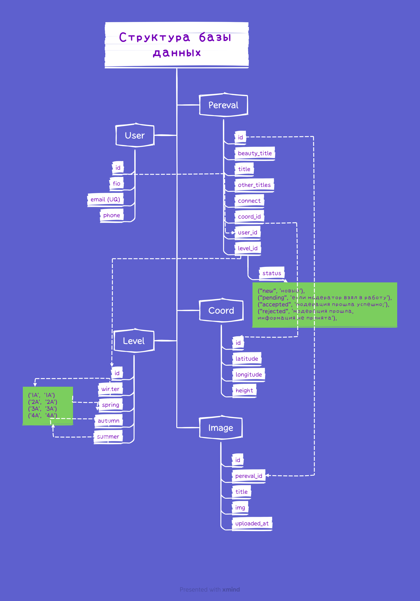

Виртуальная стажировка
======================

Итоговая аттестация (виртуальная стажировка) SkillFactory. 
Спринт/Задание по созданию Rest API в рамках совместной разработки мобильного приложения для Android и 
IOS ФСТР (Федерации Спортивного Туризма России).

Модератор из федерации будет верифицировать и вносить в базу данных информацию, полученную от пользователей, а те в 
свою очередь смогут увидеть в мобильном приложении статус модерации и просматривать базу с объектами, внесёнными другими.

Турист с помощью мобильного приложения будет передавать в ФСТР следующие данные о перевале:

### Общая информация:
- Пользователь: 
   - ФИО;
   - Электронная почта;
   - Номер телефона.
- Наименование объекта;
- Координаты объекта и его высоту;
- Уровень сложности в зависимости от времени года;
- Несколько фотографий.

Пользователь (турист) нажимает кнопку «Отправить» в мобильном приложении. 

Документация сгенерирована с помощью пакета `drf_spectacular`
Документация swagger: http://127.0.0.1:8024/schema/swagger/ 
Документация redoc: http://127.0.0.1:8024/schema/redoc/

Only_FSTR
----------
* [Python 3.11](https://www.python.org/)
* [Poetry](https://python-poetry.org/) for Python package and environment management

### Установка

1. Клонирование репозитория https://github.com/evgenijrusso/only_FSTR
2. Переход в директорию `cd mountains`
3. Запустить установку зависимостей `poetry install`
4. Вход в виртуальное окружение `poetry shell`
5. Список зависимостей `pyproject.toml`
6. Запуск Only_FSTR `python manage.py runserver 8024`
7. БД будет доступна на **localhost:5432**

### Настройки
Настройки можно указать в файле: `/work/.env`

#### Стилистика кода:
Форматирование кода происходит с помощью библиоти `flake8`

